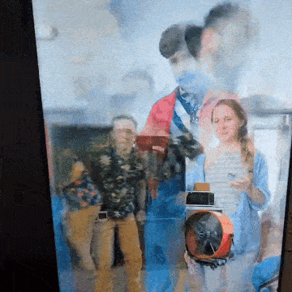

# Traces 👻

Ghostly videos of people in a "mirror."

See `__random_circles.py` for a variation of this project.

## Setup

MacOS (testing):

- `python3 -m venv .venv`
- `source .venv/bin/activate`
- `pip install -r requirements_macos.txt`
- `pip install git+https://github.com/ageitgey/face_recognition_models`

Ubuntu (production):

- `python3 -m venv .venv`
- `source .venv/bin/activate`
- `python3 -m pip install -r requirements.txt`
- `curl https://gitlab.com/Oschowa/gnome-randr/-/raw/master/gnome-randr.py -o gnome-randr.py`
- `chmod +x gnome-randr.py`
- `sudo apt update && sudo apt install -y build-essential libdbus-1-dev python3-dev libglib2.0-dev`
- `pip install dbus-python`
<!-- - `python3 -m pip install git+https://github.com/ageitgey/face_recognition_models` -->

## Test

- `python run_display.py`

## Run in Production

Start a system service:

- `mkdir -p ~/.config/systemd/user`
- `cat display.service > ~/.config/systemd/user/display.service`
- `systemctl --user daemon-reload`
- `systemctl --user enable display.service`
- `systemctl --user start display.service`
- `sudo loginctl enable-linger $(whoami)`

Show the logs:

- `journalctl --user -u display.service`

Clear logs:

- `sudo journalctl --unit=display.service --rotate`
- `sudo journalctl --vacuum-time=1s`
